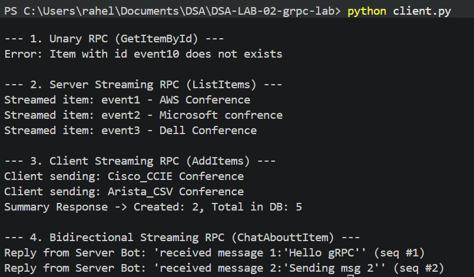
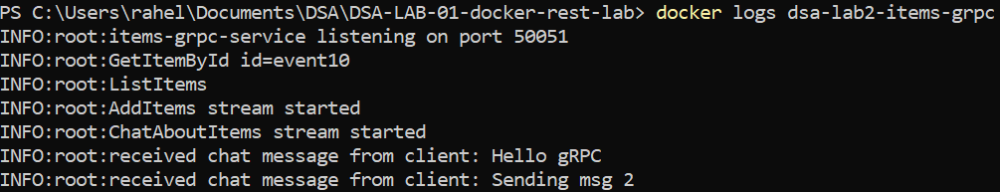
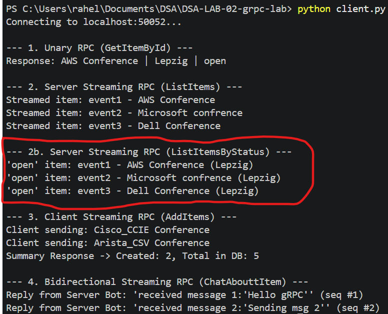

Part-1

# 1.  the command used to generate the Python stubs;
Create files from the .proto

docker run --rm -v "${PWD}:/work" -w /work python:3.13-slim sh -c "pip install --no-cache-dir grpcio-tools && python -m grpc_tools.protoc -I . --python_out=. --grpc_python_out=. items.proto"

# 2.  a short explanation of items.proto
* This .proto file defines the data structures (messages) and gRPC operations (service) for the Items service.

    syntax = "proto3"; → Uses Protobuf version 3.
    package dsa.items; → Organizes the definitions under this package.
    message Item → Represents an item with name, date, status, location, and id.
    ItemIdRequest → Sends an item ID to request a specific item.
    ListItemRequest → Empty request used to list all items.
    CreateItemRequest → Contains data needed to create an item.
    AddItemResult → Returns how many items were created and the total count.
    ChatMessage → Represents a chat message with sender, message, and sequence number.
# 3 a short explanation of the four RPC methods
* Service: ItemService defines four gRPC methods:

    GetItemById → Unary: one request → one response.
    ListItems → Server streaming: one request → multiple Item responses.
    AddItems → Client streaming: multiple requests → one result.
    ChatAbouttItem → Bidirectional streaming: client and server can continuously exchange messages.

The numbers (= 1, = 2, etc.) are unique field identifiers used by Protobuf when encoding messages.

# 4 a short explanation of-p 50052:50051;

* 50052 → port on local computer (host) and 50051 → port inside the Docker container

* localhost:50052 then docker forwards to container:50051

# 5  one paragraph on where streaming could help

* Streaming is useful when large amounts of data need to be sent continuously instead of waiting for one complete response. For example, ListItems can stream many items from the server to the client, AddItems can allow the client to send many items without separate requests

Part - 2

#1. Explain why-v"$(pwd):/work"isnecessary;

* This creates a volume mount between the current folder on Windows and /work inside the Docker container. 
* It is useful because the container can access the project files directly.
* Without -v, files generated or modified inside the container would normally remain inside the container's filesystem and would not automatically appear in your Windows project folder.
python client.py

#2. Why the generated files appear on your host machine?

* python -m grpc_tools.protoc ... will generate items_pb2.py, items_pb2_grpc.py

* /work is mounted to the current directory, /work inside Docker is our working folder

* The main purpose of volume mount is: generated source files will survive after the container stops or is removed.

#3 whyserver.pyandclient.pyshouldnotmanuallyparseProtobufbytes

* gRPC and the generated Protobuf code already handles the serialization and deserialization

# 4. which option you chose, what you changed, and what you learned

* I have choosen ListItemsByStatus - 
Change made to add the curiosity part was first on the .protobuf -  
message ListItemsByStatusRequest {          // curiosity section
    string status = 1;}

rpc ListItemsByStatus(ListItemsByStatusRequest) returns (stream Item);

# 4.1 in the client.py file we added ListItemsByStatus section- Here we can filter to see events that are currently open

 print('\n--- 2b. Server Streaming RPC (ListItemsByStatus) ---')
        status_filter = "open"
        filtered_stream = stub.ListItemsByStatus(
            items_pb2.ListItemsByStatusRequest(status=status_filter)
        )
        for item in filtered_stream:
            print(f"'{status_filter}' item: {item.id} - {item.name} ({item.location})")

# 5 Running client.py and observing the outputs

client.py

docker logs: docker logs dsa-lab2-items-grpc

client.py - Curiosity Deliverable

